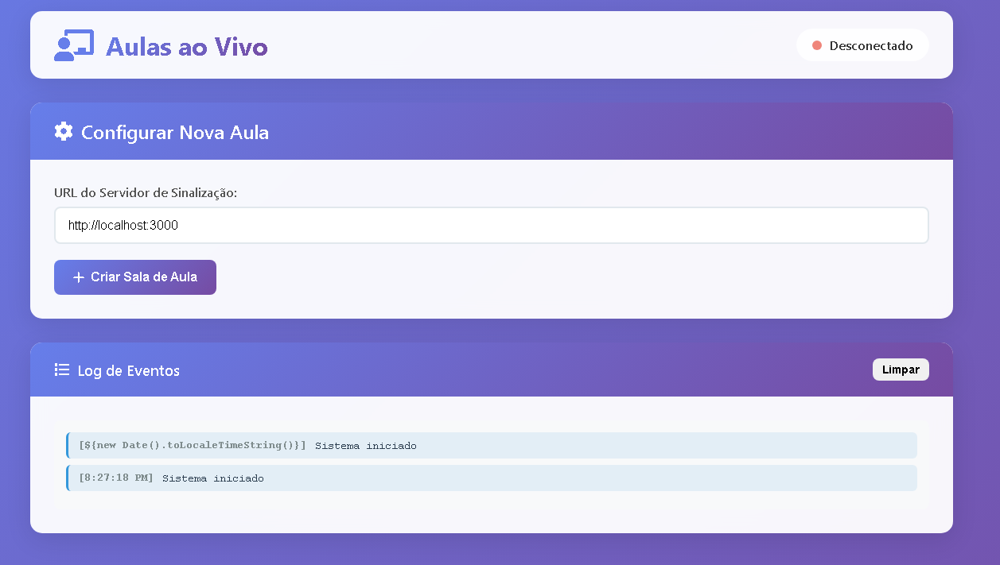
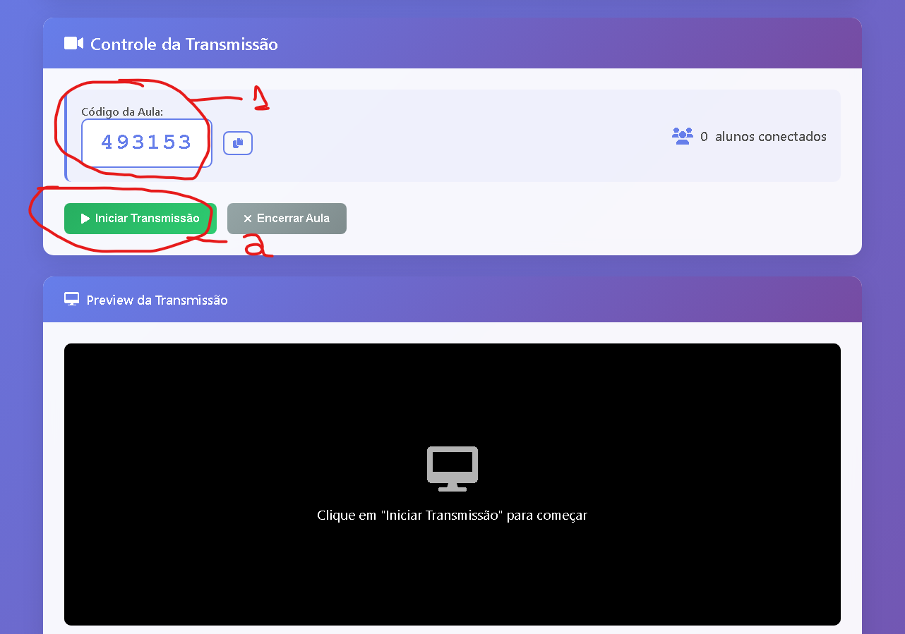
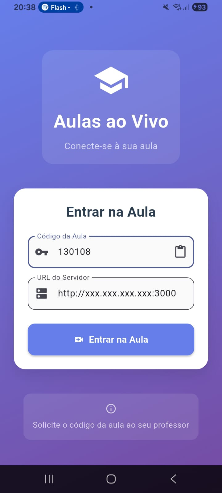
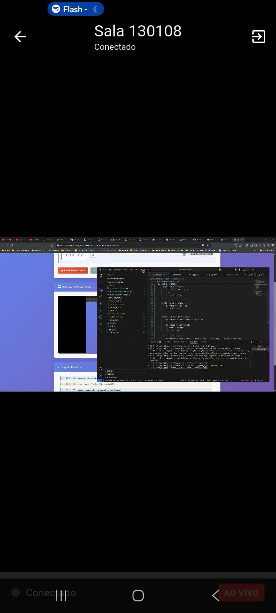

# 📚 Synchronous Class  

Aplicação para **aulas síncronas** utilizando **WebRTC**, **Socket.IO** e **Node/Express**, com suporte para:  
- 🌐 Interface Web (Professor)  
- 📱 Aplicativo Android (Flutter)(Aluno)  
- 🍏 Aplicativo iOS (Swift + SwiftUI)(Aluno) 

---

<!-- ## 🚀Padrões de commit

- Todos os PRs devem ser feitos para a branch `dev`.  
- Padrões de nomenclatura das branches (sempre usando o número da issue `NNN`):  
  - **Nova feature** → `feat-NNN/nome-da-branch`  
    - Ex: `feat-10/submitCBL`  
  - **Correções** → `fix-NNN/nome-da-branch`  
  - **Configurações** → `chore-NNN/nome-da-branch`  
  - **Testes** → `test-NNN/nome-da-branch`  
  - **Documentação** → `doc-NNN/nome-da-branch`  
  - **Refatorações** → `ref-NNN/nome-da-branch`  

--- -->

## 🛠️ Tecnologias Utilizadas  

- **Backend**: Node.js + Express + Socket.IO  
- **Streaming**: WebRTC  
- **Frontend (Professor)**: HTML, CSS e JavaScript  
- **Mobile (Aluno)**:  
  - Android → Flutter  
  - iOS → Swift + SwiftUI  

---

## ⚙️ Como Rodar o Projeto  

### 1. Servidor de Sinalização  

```bash
cd signaling_server
npm install
node server.js
cd ..
```
--- 

### 2. Ambiente do Professor (Web)

```bash
cd teacher_web_app
# abra o arquivo index.html no navegador
```

---

### 3. Versão Android (Aluno)
**Requisitos**: Flutter

```bash
cd student-webrtc-android
flutter pub get
flutter run
```
---
### 4. Versão iOS (Aluno)

- **Requisitos**: Xcode, pacotes WebRTC e Socket.IO
- Abra a pasta student-webrtc-ios no Xcode
- Instale os pacotes necessários
- Faça o build do projeto

---

## Como Utilizar
### Professor (Web)

- Acesse index.html dentro da pasta teacher_web_app

- Clique em Criar Sala e compartilhe o código gerado com os alunos

- Clique em Iniciar Transmissão e escolha entre:

- Abas do navegador;
- Janelas (aplicações);
- Tela inteira;





--- 

### Aluno (Mobile)

- Digite o código da sala fornecido pelo professor

- Configure a URL do servidor com o endereço da rede do professor

- Aguarde a transmissão iniciar





# Observações

- Certifique-se de que professor e alunos estão na mesma rede local.


- Para uso em redes externas, será necessário configurar STUN/TURN servers.
